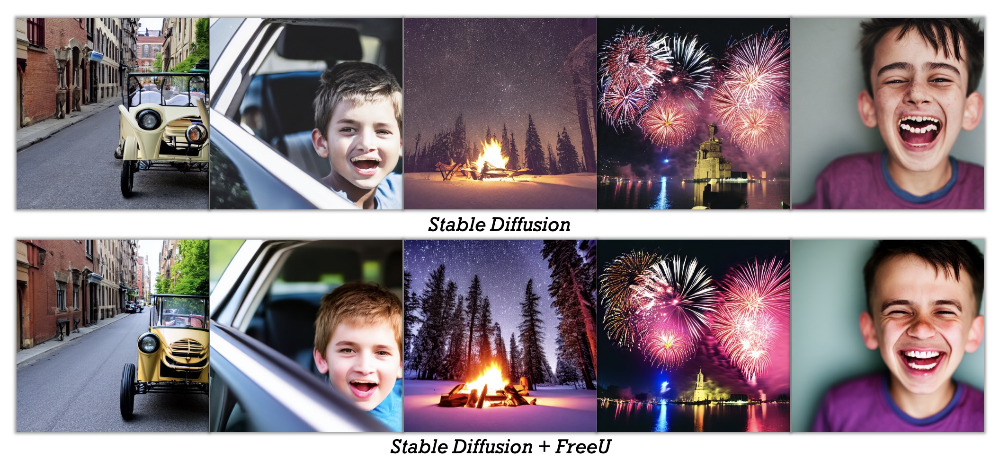
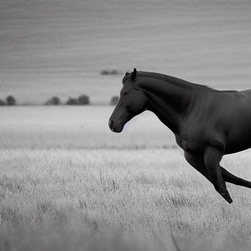
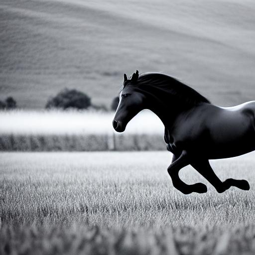

<div align="center">

<h1>Unofficial Tensorflow 2 Implementation Of FreeU: Free Lunch in Diffusion U-Net</h1>
 

[Paper](https://arxiv.org/pdf/2309.11497.pdf) | [Project Page](https://chenyangsi.top/FreeU/) | [Video](https://www.youtube.com/watch?v=-CZ5uWxvX30&t=2s)
</br>


<strong>We propose FreeU, a method that substantially improves diffusion model sample quality at no costs: no training, no additional parameter introduced, and no increase in memory or sampling time.</strong>

<div style="width: 100%; text-align: center; margin:auto;">
     
</div>
<div style="width: 100%; text-align: center; margin:auto;">


</div>
:open_book: For more visual results, go checkout our <a href="https://chenyangsi.top/FreeU/" target="_blank">project page</a>
</div>


## FreeU Code
```python
import numpy as np
import tensorflow as tf


def Fourier_filter(x, threshold=1, scale=0.9):
    x_dtype = x.dtype
    x = tf.cast(x, tf.float32)
    # FFT
    x_freq = tf.signal.fft3d(tf.cast(x, dtype=tf.complex64))
    x_freq = tf.signal.fftshift(x_freq, axes=(1, 2, 3))
    B, H, W, C = x_freq.get_shape().as_list()
    mask = np.ones((1, H, W, C), dtype=np.complex64)

    crow, ccol = H // 2, W // 2
    mask[..., crow - threshold:crow + threshold, ccol - threshold:ccol + threshold, :] = scale
    x_freq = x_freq * mask

    # IFFT
    x_freq = tf.signal.ifftshift(x_freq, axes=(1, 2, 3))
    x_filtered = tf.signal.ifft3d(x_freq)
    x_filtered = tf.math.real(x_filtered)
    return tf.cast(x_filtered, x_dtype)


def free_u(h, hs_, active=False, b1=1.2, b2=1.4, s1=0.9, s2=0.2, axis=-1):
    if active:
        if h.get_shape().as_list()[axis] == 1280:
            h1, h2 = tf.split(h, num_or_size_splits=2, axis=axis)
            h = tf.keras.layers.Concatenate(axis=axis)([h1 * b1, h2])
            hs_ = Fourier_filter(hs_, threshold=1, scale=s1)
        if h.get_shape().as_list()[axis] == 640:
            h1, h2 = tf.split(h, num_or_size_splits=2, axis=axis)
            h = tf.keras.layers.Concatenate(axis=axis)([h1 * b2, h2])
            hs_ = Fourier_filter(hs_, threshold=1, scale=s2)
    return tf.keras.layers.Concatenate(axis=axis)([h, hs_])
```

## Parameters

Feel free to adjust these parameters based on your models, image/video style, or tasks. The following parameters are for reference only.

### SD1.x: 
**b1**: 1.2, **b2**: 1.4, **s1**: 0.9, **s2**: 0.2

### SD2.x 
**b1**: 1.1, **b2**: 1.2, **s1**: 0.9, **s2**: 0.2


### Range for More Parameters
When trying additional parameters, consider the following ranges:
- **b1**: 1 ≤ b1 ≤ 1.2
- **b2**: 1.2 ≤ b2 ≤ 1.6
- **s1**: s1 ≤ 1
- **s2**: s2 ≤ 1


# Results from the community
If you tried FreeU and want to share your results, let me know and we can put up the link here.

- [SDXL](https://wandb.ai/nasirk24/UNET-FreeU-SDXL/reports/FreeU-SDXL-Optimal-Parameters--Vmlldzo1NDg4NTUw?accessToken=6745kr9rjd6e9yjevkr9bpd2lm6dpn6j00428gz5l60jrhl3gj4gubrz4aepupda) from  [Nasir Khalid](https://wandb.ai/nasirk24)
- [comfyUI](https://twitter.com/bramvera/status/1706190498220884007) from [Abraham](https://twitter.com/bramvera)
- [SD2.1](https://twitter.com/justindujardin/status/1706021278963179612) from [Justin DuJardin](https://twitter.com/justindujardin)
- [SDXL](https://twitter.com/seb_cawai/status/1705948389874000374) from [Sebastian](https://twitter.com/seb_cawai)
- [SDXL](https://twitter.com/tintwotin/status/1706318393312223346) from [tintwotin](https://twitter.com/tintwotin)
- [ComfyUI-FreeU](https://www.youtube.com/watch?v=8XJH6uZjNzA&t=297s) (YouTube)
- [ComfyUI-FreeU](https://www.bilibili.com/video/BV1om4y1G7TX/) (中文)
 

Distributed under the MIT License. See `LICENSE` for more information.

## Credits
Licenses for borrowed code can be found in following link:

- FreeU - https://github.com/ChenyangSi/FreeU
- KerasCV - https://github.com/keras-team/keras-cv 

## Donating 
If this project useful for you, please consider buying me a cup of coffee or sponsoring me!

<a href="https://paypal.me/cpuimage/USD10" target="_blank"></a>